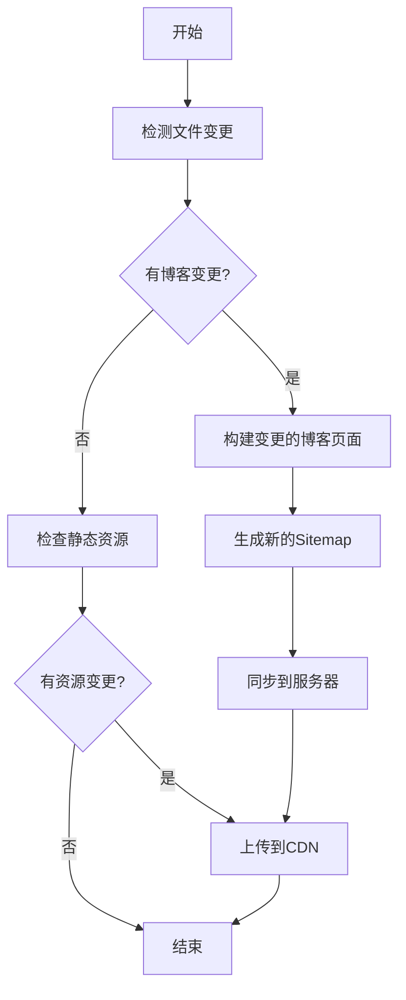

# 简化部署脚本设计方案

## 目标

创建一个轻量级的部署脚本，只做必要的更新：

- 博客内容更新
- Sitemap自动生成
- CDN资源同步

## 当前问题分析

现有的 `.github/workflows/deploy.yml` 过于复杂：

- 包含完整部署、增量部署、仅博客等多种模式
- 涉及服务器准备、Nginx配置、PM2管理等重型操作
- 每次部署耗时长，步骤多

## 简化方案设计

### 1. 脚本结构

```
scripts/
├── simple-deploy.js          # 主部署脚本
├── blog-sync.js             # 博客内容同步
├── sitemap-generator.js     # Sitemap生成器
└── cdn-sync.js              # CDN资源同步
```

### 2. 核心功能模块

#### A. 变更检测模块

- 检测 `src/content/blog/` 目录下的变更
- 检测静态资源变更（images、assets等）
- 生成变更清单

#### B. 博客同步模块

- 只构建变化的博客页面
- 增量更新服务器上的HTML文件
- 保持现有服务不中断

#### C. Sitemap生成模块

- 扫描所有博客文章
- 生成完整的sitemap.xml
- 更新lastmod时间戳

#### D. CDN同步模块

- 基于现有的 `scripts/optimized-cos-upload.cjs`
- 只上传变化的资源文件
- 智能跳过未修改文件

### 3. 执行流程



### 4. 具体实现步骤

#### 步骤1: 变更检测

```javascript
// 检测变更的文件
const changedFiles = await detectChanges();
const blogChanges = changedFiles.filter((f) =>
  f.startsWith("src/content/blog/")
);
const assetChanges = changedFiles.filter(
  (f) => f.includes("assets/") || f.includes("images/")
);
```

#### 步骤2: 增量构建

```javascript
// 只构建变化的内容
if (blogChanges.length > 0) {
  await buildChangedBlogPosts(blogChanges);
  await generateSitemap();
}
```

#### 步骤3: 服务器同步

```javascript
// 只同步变化的文件
await syncChangedFiles([
  ...blogChanges.map((f) => f.replace("src/content/blog/", "dist/blog/")),
  "dist/sitemap.xml",
]);
```

#### 步骤4: CDN同步

```javascript
// 复用现有的优化上传脚本
if (assetChanges.length > 0) {
  await runCDNSync(assetChanges);
}
```

### 5. 配置参数

```javascript
const config = {
  // 服务器配置
  server: {
    host: process.env.HOST,
    username: process.env.USERNAME,
    deployPath: "/var/www/dongboge/client",
  },

  // CDN配置
  cdn: {
    bucket: process.env.TENCENT_COS_BUCKET,
    region: process.env.TENCENT_COS_REGION,
    domain: "https://cdn.dongboge.cn",
  },

  // 构建配置
  build: {
    incremental: true,
    skipUnchanged: true,
    generateSitemap: true,
  },
};
```

### 6. 性能优化

#### 时间优化

- **现有流程**: 5-10分钟（完整构建+部署）
- **简化流程**: 1-3分钟（仅变更内容）

#### 资源优化

- 跳过服务器重启
- 跳过Nginx配置更新
- 跳过依赖安装
- 只传输变化文件

### 7. 安全考虑

#### 回滚机制

```javascript
// 备份当前版本
await backupCurrentVersion();

try {
  await deployChanges();
} catch (error) {
  await rollbackToPreviousVersion();
  throw error;
}
```

#### 验证机制

```javascript
// 部署后验证
await validateDeployment([
  "https://dongboge.cn/sitemap.xml",
  "https://dongboge.cn/blog/",
  ...changedBlogUrls,
]);
```

### 8. 使用方式

#### GitHub Actions触发

```yaml
name: 简化博客更新
on:
  push:
    paths:
      - "src/content/blog/**"
      - "public/images/**"
      - "src/assets/**"

jobs:
  simple-deploy:
    runs-on: ubuntu-latest
    steps:
      - uses: actions/checkout@v4
      - name: 运行简化部署
        run: node scripts/simple-deploy.js
```

#### 手动触发

```bash
# 本地运行
npm run deploy:simple

# 或直接运行
node scripts/simple-deploy.js
```

### 9. 监控和日志

```javascript
// 部署报告
const report = {
  timestamp: new Date().toISOString(),
  changedFiles: blogChanges.length,
  uploadedAssets: assetChanges.length,
  duration: endTime - startTime,
  status: "success",
};

console.log("📊 部署报告:", report);
```

### 10. 与现有系统的兼容性

- **保持现有的完整部署流程**作为备用
- **新增简化流程**用于日常博客更新
- **可以随时切换**回完整部署模式

## 预期效果

1. **部署时间**: 从5-10分钟缩短到1-3分钟
2. **资源消耗**: 减少80%的不必要操作
3. **稳定性**: 减少服务中断风险
4. **维护性**: 代码更简洁，易于调试

## 实施建议

1. **第一阶段**: 创建基础的变更检测和增量构建
2. **第二阶段**: 集成CDN同步和服务器部署
3. **第三阶段**: 添加监控、日志和回滚机制
4. **第四阶段**: 优化性能和用户体验

这个方案是否符合你的需求？我可以开始实现具体的脚本代码。

## ⚠️ 重要：Slug处理

### 问题发现

现有的sitemap生成脚本存在bug：使用文件名作为URL路径，而不是frontmatter中的`slug`字段。

### 正确的处理方式

#### 博客文章结构示例

```markdown
---
title: "2024年十月重新出发"
slug: "2024-october-fresh-start" # 这个是URL中使用的路径
pubDate: "Jul 19, 2025"
---
```

#### URL映射关系

- **文件名**: `2024年十月重新出发.md`
- **正确URL**: `https://dongboge.cn/blog/2024-october-fresh-start/`
- **错误URL**: `https://dongboge.cn/blog/2024年十月重新出发/`

### 修复方案

#### 1. 正确读取frontmatter

```javascript
function extractSlugFromPost(filePath) {
  const content = fs.readFileSync(filePath, "utf8");
  const frontmatterMatch = content.match(/^---\n([\s\S]*?)\n---/);

  if (frontmatterMatch) {
    const frontmatter = frontmatterMatch[1];
    const slugMatch = frontmatter.match(/slug:\s*['"]?([^'"]+)['"]?/);

    if (slugMatch) {
      return slugMatch[1]; // 返回slug值
    }
  }

  // 如果没有slug，使用文件名作为fallback
  return path.basename(filePath, ".md");
}
```

#### 2. 生成正确的sitemap URL

```javascript
posts.forEach((post) => {
  const slug = extractSlugFromPost(post.filePath);
  const url = `${baseUrl}/blog/${slug}/`;

  sitemap += `
    <url>
        <loc>${url}</loc>
        <lastmod>${post.lastmod}</lastmod>
        <changefreq>monthly</changefreq>
        <priority>0.6</priority>
    </url>`;
});
```

#### 3. 变更检测中的slug处理

```javascript
// 检测博客变更时，需要同时返回文件路径和slug
function detectBlogChanges() {
  const changedFiles = getChangedFiles();
  const blogChanges = [];

  changedFiles.forEach((file) => {
    if (file.startsWith("src/content/blog/")) {
      const slug = extractSlugFromPost(file);
      blogChanges.push({
        filePath: file,
        slug: slug,
        url: `/blog/${slug}/`,
      });
    }
  });

  return blogChanges;
}
```

### 简化脚本中的应用

在简化部署脚本中，我们需要确保：

1. **变更检测时**：记录文件路径和对应的slug
2. **sitemap生成时**：使用slug而不是文件名
3. **服务器同步时**：同步到正确的URL路径

这样可以确保生成的sitemap中的URL都是可访问的正确地址。
